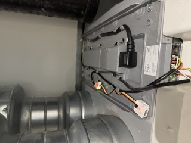
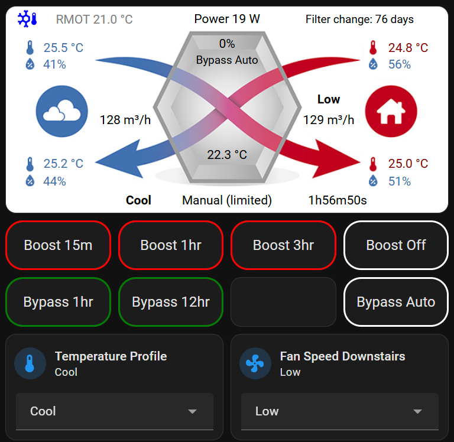

# Zehnder-Q-ESPHome
Customisation and instructions for Home Assistant ESPHome project created by @yoziru which provides an integration with Zehnder Q-series MVHR units.

This is work in progress

These instructions explain how I added an ESPHome monitor/controller into my Zehnder Comfoair Q-series MVHR unit. It is entirely based on the project by @yoziru at [yoziru project](https://github.com/yoziru/esphome-zehnder-comfoair/tree/main)

The reason I produced this was that the project had a compile error for me as there seemed to be a depracated statement. I also am trying to create more detailed instructions as this was all new to me so I'm trying to fill in more detail for those who are not familair with ESPHome. 

In doing this I did refactor the project Yaml file and one of it's dependents in order to put all the things you might want to change and external references in one place.

These instructions assume you are using Home Assistant and that you have Wi-Fi reception where your MVHR unit is sited.

Your Home Assistant will need a file manager add-on such as Studio Code Server.

## Prerequisites Parts
1.	AtomS3 Lite - ESP32 processor
2.	Mini CAN Unit (TJA1051T/3) - Canbus interface unit
3.	4-core cable - Canbus cable with red/black/yellow/white cores is the best thing
4.	A USB-C cable to connect to the AtomS3 Lite to your PC/Mac for program load. This must be a data cable – some are just charge cables.

## Home Assistant Add-on
For your Home Assistant system install ESPHOME device builder as an add-on. Go to Settings / Add-ons then press the Add-on Store button on the bottom right. Search for “ESPHome Device Builder” and install it.

## Software build
### Yoziru Files
On your PC go to [yoziru project](https://github.com/yoziru/esphome-zehnder-comfoair/tree/main)

Download the files from this repository by clicking on “Code” in the top left and then with the green “Code” drop down button select “Download Zip”

Unzip these files into a folder

Using your file manager on Home Assistant you should see a folder called esphome at the top level of the home assistant configuration files


 
From the folder with the downloaded files, copy in the the folders "boards" and "packages" into the top level of esphome

Click on the boards folder and select the file m5stack-atoms3.yml.

Edit line 41 of the file to put a # (comment out) at the start of the line (this is to avoid a compile error for a depracated feature)


 
### Additional files
Now go to [Additional Files](https://github.com/jrviz/Zehnder-Q-ESPHome) and download the files secrets.yaml.example master and new_base.yaml

Copy zehnder-comfoair-q-m5stack-atoms3-updated.yml to the top level of the esphome folder. You can edit this file to change the device name and description

Copy in secrets.yaml.example into the top level of esphome and rename it to secrets.yaml
Select and edit this file to put your wifi ssid and password detail in ( top 2 lines)
On the last line of this file your will see a 32 character api security key Visit the link in the comment and the page will show a new key (it generates a new one every time you visit that page). Copy that key and replace the one that is already there.

Copy the file  new_base.yml into the packages folder
You should now have something like this:


Note that I changed the name of my updated file in this example. Yours will be zehnder-comfoair-q-m5stack-atoms3-updated.yml unless you change it.

You should now have an edited secrets.yaml file, the zehnder-comfoair-q-m5stack-atoms3-updated.yml, the new_base.yml file copied into the packages folder and the edited m5stack-atoms3.yml in the boards folder

## Prepare image for AtomS3 Lite
In your Home Assistant go to  Settings / Add-ons
Select the ESPHome Device builder and then select the ”Open Web UI” option
You should now see your project in the dashboard

Select three dots menu in botton right and select Validate
If there is a success message at end (last line says INFO Configuration is valid!) then select Install from the three dots menu
This will pop up options. Select "Plug into this computer" This will now build. It will take a while and have a spinning cursor next to "preparing download…" as step 1. Don't lose patience this will take 10's of minutes.

When this has finished, step 1 will show a download option. When this is pressed you will get two options. Select the "Factory Format (previously Modern)" option. 

This will download a file to your PC.

Select Step 2. Open ESPHome Web

Plug your atomS3lite into the usb-c cable attached to your PC, you should see the device shown when your press the "CONNECT" although it will just have a hardware name. Select the device and press "connect"

Then press "Install"

This will load the program onto the unit

You should now go onto the hardware build.
 


## Hardware build
First remove the top “tray” of the MVHR unit. It just slides off.


Cut around 45-50cm of 4-core cable


Strip ends for both

Connect one end to plug for canbus interface as shown


Unplug this connection from canbus unit and connect into mvhr. Put the end cable tails into the top hole while pressing the lower button (with a hole in it) in, when released this grips the cable


Plug the canbus interface into the atoms3 using the supplied cable


Plug the canbus interface plug, which is connected into the MVHR, into the modules


 
Replace the lid 

## HA adoption
The device should appear under the HA Esp home device - discovered. Click Add and it will ask for the encryption key. Copy this from the top level yaml file (without quotes) and paste into this field. 
The device should show live parameters and controls. The atom s3 also publishes a web page with data and controls. It is a simple port 80 web page on its ip address.

##Add device to Home Assistant
Go into Home Assistant Settings / Devices and services
You should see your device as Discovered in the top area
Select Add and then confirm with Submit
At this stage you will need the api encryption key which is in the secrets.yaml file. Copy this text (not the quotes) into the api field and press Submit
 
That should be it. To check you can go into Settings / Devices and services and you should see ESPHome as a device. Open this and click on the device and you should see live data. NOTE: I have seen instances where it takes alittle while to populate the data but it is usually very quick.

## Home Assistant Dashboard elements

To add something like this to a dashboard



### Set up background image
In Home Assistant use the file manager to create a new folder called images under www 
Copy from the docs\home-assistant folder of the yoziru files that the downloaded the file called ventilation.png into the new images folder


### Dashboard section with image and buttons
To put this into a dashboard add a section to a dashboard, edit the section and and open the yaml (three vertical dots at top right of the section in edit mode) and add the following yaml


```yaml
type: grid
cards:
  - type: heading
    heading: Downstairs MVHR
    heading_style: title
    grid_options:
      columns: full
      rows: 1
  - type: picture-elements
    image: /local/images/ventilation.png
    style: |
      ha-card { height: 150px !important; }
    elements:
      - type: state-label
        entity: sensor.xxxxxxxxxxxxxx_fan_level
        style:
          top: 49%
          left: 73%
          color: black
          font-size: 10px
      - type: state-label
        entity: sensor.xxxxxxxxxxxxxx_supply_fan_flow
        style:
          top: 59%
          left: 73%
          color: black
      - type: state-label
        entity: sensor.xxxxxxxxxxxxxx_exhaust_fan_flow
        style:
          top: 59%
          left: 27%
          color: black
      - type: state-label
        entity: sensor.xxxxxxxxxxxxxx_extract_air_temperature
        style:
          top: 20%
          left: 91%
          color: darkred
      - type: state-label
        entity: sensor.xxxxxxxxxxxxxx_extract_air_humidity
        style:
          top: 28%
          left: 89%
          color: "#4171b1"
      - type: state-label
        entity: sensor.xxxxxxxxxxxxxx_supply_air_temperature
        style:
          top: 76.2%
          left: 91%
          color: darkred
      - type: state-label
        entity: sensor.xxxxxxxxxxxxxx_supply_air_humidity
        style:
          top: 84.6%
          left: 89%
          color: "#4171b1"
      - type: state-label
        entity: sensor.xxxxxxxxxxxxxx_outdoor_air_temperature
        style:
          top: 20%
          left: 13%
          color: "#4171b1"
      - type: state-label
        entity: sensor.xxxxxxxxxxxxxx_outdoor_air_humidity
        style:
          top: 28%
          left: 11%
          color: "#4171b1"
      - type: state-label
        entity: sensor.xxxxxxxxxxxxxx_exhaust_air_temperature
        style:
          top: 76.2%
          left: 13%
          color: "#4171b1"
      - type: state-label
        entity: sensor.xxxxxxxxxxxxxx_exhaust_air_humidity
        style:
          top: 84.6%
          left: 11%
          color: "#4171b1"
      - type: state-label
        entity: sensor.xxxxxxxxxxxxxx_bypass_activation_mode
        prefix: "Bypass "
        style:
          color: black
          top: 26%
          left: 50%
          font-size: 80%
      - type: conditional
        conditions:
          - entity: sensor.xxxxxxxxxxxxxx_bypass_state
            state_not: "0"
        elements:
          - type: state-label
            entity: sensor.xxxxxxxxxxxxxx_bypass_state
            style:
              color: black
              top: 18%
              left: 50%
      - type: conditional
        conditions:
          - entity: sensor.xxxxxxxxxxxxxx_next_bypass_change_in
            state_not: n/a
        elements:
          - type: state-label
            entity: sensor.xxxxxxxxxxxxxx_next_bypass_change_in
            style:
              color: black
              top: 33%
              left: 50%
              font-size: 80%
      - type: state-label
        entity: sensor.xxxxxxxxxxxxxx_operating_mode
        style:
          top: 72%
          left: 50%
          color: black
      - type: state-label
        entity: sensor.xxxxxxxxxxxxxx_profile_target_temperature
        style:
          color: black
          top: 60%
          left: 50%
          font-size: 70%
      - type: state-label
        entity: sensor.xxxxxxxxxxxxxx_temperature_profile
        style:
          color: black
          top: 66%
          left: 50%
          font-size: 70%
      - type: conditional
        conditions:
          - entity: sensor.xxxxxxxxxxxxxx_next_fan_change_in
            state_not: n/a
        elements:
          - type: state-label
            entity: sensor.xxxxxxxxxxxxxx_next_fan_change_in
            style:
              color: black
              top: 80%
              left: 50%
              font-size: 80%
      - type: state-label
        entity: sensor.xxxxxxxxxxxxxx_filter_replacement_remaining_days
        prefix: "Filter change: "
        style:
          top: 94%
          left: 50%
          color: black
      - type: state-label
        entity: sensor.xxxxxxxxxxxxxx_power
        prefix: "Power "
        style:
          top: 6%
          left: 50%
          color: black
      - type: state-label
        entity: sensor.xxxxxxxxxxxxxx_running_mean_outdoor_temperature
        prefix: "RMOT "
        style:
          top: 6.5%
          left: 20%
          color: grey
      - type: conditional
        conditions:
          - entity: binary_sensor.xxxxxxxxxxxxxx_heating_season
            state: "on"
        elements:
          - type: icon
            icon: mdi:sun-thermometer
            style:
              color: orange
              top: 6%
              left: 5%
      - type: conditional
        conditions:
          - entity: binary_sensor.xxxxxxxxxxxxxx_cooling_season
            state: "on"
        elements:
          - type: icon
            icon: mdi:snowflake-thermometer
            style:
              color: blue
              top: 6%
              left: 5%
  - show_name: true
    show_icon: true
    type: button
    entity: button.xxxxxxxxxxxxxx_boost_15_min
    tap_action:
      action: toggle
    name: Boost 15m
  - show_name: true
    show_icon: true
    type: button
    entity: button.xxxxxxxxxxxxxx_boost_60_min
    tap_action:
      action: toggle
    name: Boost 1hr
  - show_name: true
    show_icon: true
    type: button
    entity: button.xxxxxxxxxxxxxx_boost_3h
    tap_action:
      action: toggle
    name: Boost 3hr
  - show_name: true
    show_icon: true
    type: button
    entity: button.xxxxxxxxxxxxxx_boost_off
    tap_action:
      action: toggle
    name: Boost Off
  - show_name: true
    show_icon: true
    type: button
    entity: button.xxxxxxxxxxxxxx_bypass_on_1h
    tap_action:
      action: toggle
    name: Bypass 1hr
  - show_name: true
    show_icon: true
    type: button
    entity: button.xxxxxxxxxxxxxx_bypass_on_12h
    tap_action:
      action: toggle
    name: Bypass 12hr
  - show_name: true
    show_icon: true
    type: button
    entity: button.xxxxxxxxxxxxxx_bypass_auto
    tap_action:
      action: toggle
    name: Bypass Auto
  - type: custom:mushroom-select-card
    entity: select.xxxxxxxxxxxxxx_temperature_profile
    name: Temperature Profile
column_span: 1
```

Replacing xxxxxxxxxxxxxx with your device name. Look at a a sensor for the MVHR unit to see this name as the compile options set will create Home Assistant entities of the form <device_name>_<mac_digits>

## Web Page
The device also publishes a web page with the data and controls. Just open a browser at the address assigned for the module.
